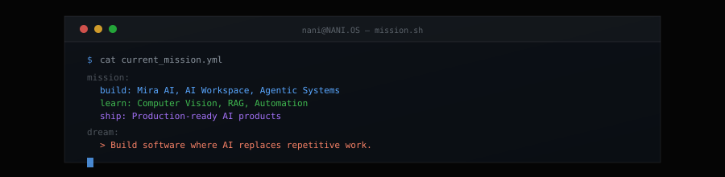

 

 

 

 

 

 

<picture>
  <source media="(prefers-color-scheme: dark)" srcset="https://raw.githubusercontent.com/nani301/nani301/output/github-snake-dark.svg"/>
  <source media="(prefers-color-scheme: light)" srcset="https://raw.githubusercontent.com/nani301/nani301/output/github-snake.svg"/>
  
</picture>

 

svg)](#)

